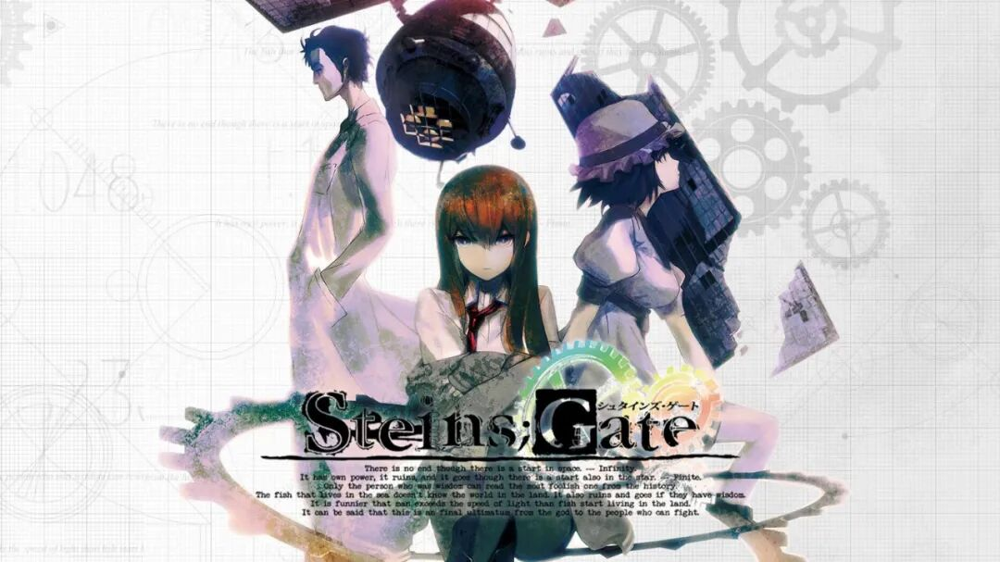

      
  

  

* * *

  

捏嘻嘻，本社的第一条更新终于是来了呀_✧_｡٩(ˊᗜˋ\*)و✧\*。无论你是初次接触的新同学，还是入坑已久的老油条，都让我们携手社团，迈出“第一步”，去体验入坑的喜悦，或重温当初入坑时的感动吧(๑•̀⌄•́๑)！

  

* * *

  

# 1 如何找到自己喜欢的作品

  

1. 专门的视觉小说数据库和评分网站，例如 **VNDB (Visual Novel Database)**，它收录了全球绝大多数视觉小说作品，用户可以给作品打分、写评论、标记标签，你能通过“最高评分”“最多推荐”等筛选来发现评价很高的作品。

  

2. **论坛与社区**，像 Reddit 的 r/visualnovels、百度贴吧“Galgame吧”、或 NGA 等中文社区，都会定期有玩家整理“必玩神作榜单”或“年度推荐”。这些榜单往往包含主观推荐，但也很适合做参考。

  

3. **游戏平台与商店**，例如 Steam 上的视觉小说分类。你可以直接按“用户评价”“好评率”进行排序，找到口碑稳定的作品。

  

4. **媒体与个人推荐**，比如 YouTube 上的 VN 博主、Bilibili 的“年度必玩 VN”视频，或者一些视觉小说相关公众号/网站的推荐榜单，也能帮助你快速筛选。

  

# 2 资源下载

1. 在哪能找到资源
- 百度贴吧，b站相关视频，搜索引擎（别用百度，用谷歌或bing之类的），QQ群， 以及各种资源站

2. 如何分辨资源链接 / 使用资源

## 常见资源分享方式

| 类型 | 链接格式示例 | 常见用途 | 是否需要额外解码/提取码 |
| --- | --- | --- | ----- |
| **磁力链接（Magnet Link）** | `magnet:?xt=urn:btih:xxxxx...` | P2P 文件分享（BitTorrent） | 不需要，直接用 BT 客户端即可 |
| **BT 种子文件** | `.torrent 文件` | P2P 文件分享（需种子文件） | 不需要 |
| **网盘链接** | `https://pan.baidu.com/s/xxxx` `https://drive.google.com/file/d/...` | 百度网盘, Google Drive, OneDrive, Dropbox 等 | 常常需要提取码或访问权限 |
| **直链下载** | `http(s)://.../filename.zip` | 官方网站、个人服务器直链 | 不需要（但可能设置密码） |
| **电驴（eMule）链接** | `ed2k://file...` | 电驴网络文件分享 | 不需要 |
| **迅雷链接** | `thunder://xxxxx` | 迅雷下载 | 迅雷客户端自动解码 |
| **短链/跳转链接** | `https://bit.ly/xxxx` `https://t.cn/xxxx` | 链接缩短/跳转 | 不需要（但实际目标需再访问） |

  

* * *

  

## 常见加密/混淆方式

| 加密/混淆方式 | 示例 | 解码方式 |
| --- | --- | --- |
| **提取码** | 网盘：`提取码 abcd` | 手动输入 |
| **兽语** | ~呜嗷嗷嗷嗷呜呜呜呜嗷呜嗷呜呜啊呜啊嗷啊嗷啊呜~呜~~~嗷~呜嗷呜呜嗷嗷嗷嗷呜呜呜呜嗷呜嗷呜呜啊呜啊~啊 | 兽音译者等网站 |
| **分段拼接** | `hxxps://pan.baidu.com/s/` + `xxxx` | 手动拼接 |
| **Base64 编码** | `aHR0cHM6Ly9wYW4uYmFpZHUuY29tL3MveHh4eA++` | Base64 解码 |
| **压缩包加密** | 文件打包成 `.zip/.rar` 并加密 | 输入解压密码 |
| **图片/文字隐写** | 链接藏在图片或特殊符号中 | 特定工具或手动识别 |

  

Q3, 如何解压

A3, 使用WinRAR， 7z等软件。使用教程请自行搜索。

注：不要在线解压。不要在线解压。不要在线解压。

# 3 支持正版

1. **Steam 等国际平台(多数锁国区)**。许多知名的视觉小说已经在 Steam 上正式发售，并且支持人民币结算。通过 Steam 购买是最直接、最方便的正版支持方式。

2. **DLsite、DMM 等日本数字平台**。这些网站上几乎可以找到绝大部分日系视觉小说的数字版，只要有国际支付方式（如信用卡、PayPal），就能购买下载。

3. **实体限定版/周边**。部分厂商会在日本或国际电商（Amazon Japan、Suruga-ya 等）发售实体光盘、限定版、原画集等，国内玩家可以通过海淘网站或代购渠道购买，这也是一种直接支持。

4. **国内的正版合作平台（基本买不到几个）**。比如 WeGame、Steam 国区特供的一些 VN（数量有限），或者 Bilibili 游戏曾经代理过少量的正版 VN。

# 4 入坑作品推荐（感兴趣请自行搜索）

## 1. 废萌

《メイキング\*ラバーズ》

SMEE超级糖精

## 2. 泣系（感人的）

《Clannad》

Key社经典

## 3. 科幻

《STEINS;GATE》  
命运石之门系列

“哇是科学ADV，我们有救了”

## 4. 电波

《素晴らしき日々 〜不連続存在〜》

（也叫素晴日）

## 5. 猎奇

《壳之少女》

悬疑，重口作（有尸检内容），慎入！

## 6. 笔者私货

《近月少女的礼仪》

哎呀一看就全都是女的（确信）。伪娘作慎入！